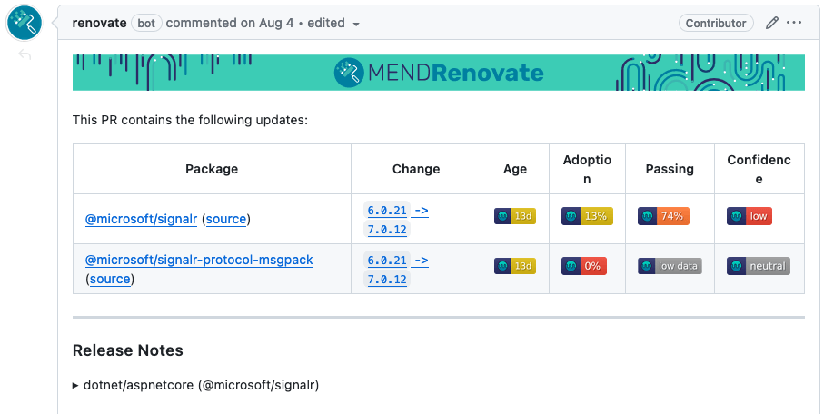

---
sidebar_custom_props:
  access: bitwarden
---

# Dependency Management

Bitwarden uses [Renovate](https://www.mend.io/renovate/) for automating dependency updates. Renovate
will automatically create pull requests for dependencies on a weekly cadence. Security updates will
generate pull requests immediately.

## Ownership

Bitwarden's repositories fall under two categories: team-owned and shared.

### Team-owned repositories

Team-owned repositories are "owned" by a single team from a dependency standpoint. The assigned team
is responsible for reviewing, approving, and merging dependency updates. Some reasons a repository
might be team-owned are that it's primarily developed by that team, or to balance out the number of
dependencies teams have to manage.

Some examples of team-owned repositories are [`directory-connector`][dc], which is owned by the
_Admin Console_ team, and [`key-connector`][kc], which is owned by the Auth team.

### Shared repositories

Shared repositories don't have any direct owner. Instead each dependency is allocated to a team. The
team assigned to a dependency is responsible for reviewing, approving, and merging that dependency.
For major upgrades the team is responsible for coordinating the upgrade with the other teams.

Examples of shared repositories are [`server`][server] and [`clients`][clients].

## Example PR

<figure>



<figcaption>Example Renovate PR</figcaption>

</figure>

Renovate PRs contain several areas of interest. The above example PR contains two grouped
dependencies. The PR proposes to upgrade the dependencies from `6.0.21` to `7.0.12`. The age of the
version is **13 days**, and **13%** of repositories have adopted this version. Renovate has seen a
**74%** test success rate across Renovate-managed repositories and has a low confidence in the
change. For more details read
[Renovate documentation about Merge Confidence](https://docs.renovatebot.com/merge-confidence/).

## Workflow

Renovate will automatically create pull requests during the weekend, which naturally aligns with
each team allocating some time during the following Monday to work through their respective queue of
pull requests. The teams should work together to resolve outstanding pull requests within the week
to avoid stagnation.

:::info

The main exception being major upgrades that can sometimes take a longer amount of time to
coordinate. Ideally the team will have already coordinated and resolved deprecations in advance.

:::

A Renovate PR may contain a single dependency or a group of related dependencies. At Bitwarden, we
typically group dependencies we know are related and should be upgraded at the same time. We try to
keep groups as small as possible to minimize the impact and increase confidence in approving and
merging.

### Review

A typical dependency workflow involves the following steps:

1. Read the proposed changes.
2. Review the release notes of each dependency, for each released version between the current and
   the proposed upgrade. Identify if there are any deprecations or breaking changes affecting our
   code.
   1. For breaking changes, either resolve them yourself, or for major changes, coordinate with the
      other teams.
   2. For deprecations, create high priority Jira tickets on the affected teams' backlogs with a due
      date at least one sprint before the next scheduled major release of the dependency.
3. Verify CI status.
4. If test coverage is lacking, check out locally and manually confirm a few key areas.
5. Review the proposed code changes and approve the PR.
6. Write a Jira ticket containing testing notes for QA.
7. Merge the PR. Assign the Jira ticket to QA.

If you need to change the code to resolve any issues, please tag a team member for the final review.

### Jira ticket

The handoff between developers and QA will be a Jira ticket. The ticket should contain the affected
dependency, any relevant release notes for sections to test, and some testing notes on affected
areas.

### QA testing

While developers are responsible for writing a Jira ticket with testing notes, the QA engineer
should practice due diligence by also considering the impact of the dependency change and if needed
discuss with the engineer about potentially increasing or decreasing the scope of testing.

### Reverting

In the event QA finds a regression, the developer is responsible for assessing the impact and either
immediately revert the update or resolve the regression in a new PR.

### Closing irrelevant PRs

Sometimes Renovate will create PRs for dependencies that we are currently unable to upgrade for
various reasons. For example, `contributing-docs` depends on `docusaurus`, which supports specific
versions of `react`. We cannot upgrade `react` until `docusaurus` supports it.

In those cases the team can comment on the PR with a reason for not yet upgrading and defer the PR
until a later date.

## Renovate configuration

Renovate is configured by a `.github/renovate.json` file in each repository. We follow an internal
template for consistency. The template is available at the
[template repository](https://github.com/bitwarden/template/blob/main/.github/renovate.json).

Renovate uses a concept called
[`PackageRules`](https://docs.renovatebot.com/configuration-options/#packagerules) that allows us to
specify ownership of dependencies and ensure the appropriate team is added as reviewers. Below is an
example assigning `@angular/core` to the Platform team.

```json
{
  "matchPackageNames": ["@angular/core"],
  "description": "Platform owned dependencies",
  "commitMessagePrefix": "[deps] Platform:",
  "reviewers": ["team:team-platform-dev"]
}
```

For repositories maintained by a single team there is no need to use `packageRules` to assign
ownership. Instead ensure appropriate code owners are set up.

[dc]: https://github.com/bitwarden/directory-connector
[kc]: https://github.com/bitwarden/key-connector/
[server]: https://github.com/bitwarden/server/
[clients]: https://github.com/bitwarden/clients/
