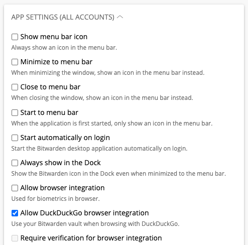

# Native Messaging Test Runner

The Native Messaging Test Runner is a Node application for testing the Native Messaging
functionality in Desktop, specifically the commands received from the DuckDuckGo browser. It
communicates with the desktop app using Inter-process communication (IPC). It was created to enable
development on the native messages themselves, and to give QA the ability to test these commands. It
is located
[here](https://github.com/bitwarden/clients/tree/master/apps/desktop/native-messaging-test-runner)
at the root of the `desktop` app in `bitwarden/clients` repo.

## Getting Started

1.  Clone the [bitwarden/clients](https://github.com/bitwarden/clients) repo
2.  Run the desktop app locally following
    [these](https://contributing-internal.bitwarden.com/external/clients/desktop/) instructions
3.  In the running desktop app, go to `Preferences` and turn on the
    `Allow DuckDuckGo browser integration` setting:

    

4.  In a separate terminal, navigate into `apps/desktop/native-messaging-test-runner`
5.  Run `npm ci`
6.  Pick a command and run it! A good one to start with is `status`. A full list of commands can be
    seen in the `Commands` section of this doc. Some commands take parameters such as `create`. When
    running these, pass parameters the following way, with two additional dashes before all of the
    parameters: ` npm run create -- --name NewLogin!` **NOTE** You will need to accept the prompt in
    the desktop app before each command. This is for sure an area of improvement.

    

:::caution

These commands are run against your local running desktop instance and whatever accounts you have in
there. You will need to set up your accounts and vaults beforehand to test these commands properly.

:::

## Architecture and Structure

### Commands

The commands folder contains the runable node scripts/commands. There is currently one file per
native messaging command for testing.

1. **`handshake`** Sends a `bw-handshake` command and establishes communication with the native
   messaging service in the desktop app

   - **Parameters:** none
   - **Example Usage:** `npm run handshake`

2. **`status`** Sends a `bw-status` command and returns an array of the accounts configured in the
   desktop app.

   - **Parameters:** none
   - **Example Usage:** `npm run status`

3. **`create`** Sends a `bw-credential-create` command and creates a new login with the provided
   name and test data for the other fields.

   - **Parameters:** `--name`
   - **Example Usage:** `npm run create -- --name NewLoginFromTestRunner`

4. **`update`** Sends a `bw-credential-update` command and updates a credential with the provided
   fields.

   - **Parameters:** `--name`, `--username`, `--password`, `--uri`, `--credentialId`
   - **Example Usage:**
     `npm run update -- --name UpdateLoginFromTestRunner --username rmaccallum --password dolphin123 --uri google.com --credentialId 8fdd5921-4b10-4c47-9f92-af2b0106d63a`

5. **`retrieve`** Sends a `bw-credential-retrieval` command and returns a list of credentials
   matching the uri provided

   - **Parameters:** `--uri`
   - **Example Usage:** `npm run retrieve -- --uri google.com`

6. **`generate`** Sends a `bw-generate-password` command and returns a password/passphrase using the
   settings of the userId passed to it
   - **Parameters:** `--userId`
   - **Example Usage:** `npm run generate -- --userId fe2af956-a6a6-468c-bc8c-ae6600e48bdd`

### IPCService

This service manages the connections to a socket and the sending and receiving of messages on that
socket.

### NativeMessageService

This service uses the IPCService to connect to the locally running Bitwarden desktop app's IPC proxy
service. It uses Bitwarden's crypto service and functions to handle encrytption and decryption of
the messages. It utilizes a test public/private key pair located in the
`/native-messaging-test-runner/src/variables.ts` file.

### Other

#### I thought Node used JavaScript? How are we using TypeScript classes, including the ones from libs?

Great question! With a little magic✨ we are compiling these TypeSript files into the JavaScript
that Node knows and loves. This is done is with a couple of mechanisms:

- **`tsconfig.json`:** In the `paths` node of this file, the files in the paths provided are
  compiled into pure JavaScript and placed in the `dist` folder.

- **`package.json`:** The `module_alias` is installed which allows us to map any services used in
  the TypeScript files to their compiled JavaScript equivalents. The paths of the files that are
  used directly in any of the command files are defined in the `"_moduleAliases"` node of the
  package.json.

#### Deferred

Class that overrides the default implementations of the JavaScript `Promise` interface's `resolve`
and `reject` methods in order to allow us to await responses to messages sent over IPC.

#### logUtils

Utils class that adds nice color formatting to `console.log()`s throughout this app.

#### race

Utility used by the `IPCService` when creating a promise that allows the usage of a timeout when
waiting for messages. We can't guarantee that we will get a response from the desktop app, so this
allows us to gracefully cancel if a response isn't received in a timely manner.

## Troubleshooting

- If you are seeing unexpected behavior with services used by the test runner or when editing
  commands, delete the `dist` folder at the top level of the `native-messaging-test-runner` and
  re-run the command.

- If you are adding/editing command files and getting a `MODULE_NOT_FOUND` error when running the
  command, make sure you have `import "module-alias/register";` in your command file. This maps the
  compiled JavaScript classes to the ones used in the Typescript files.

  
